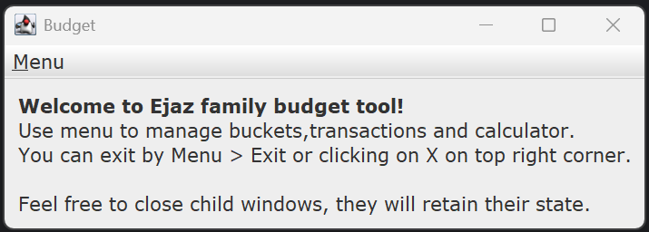
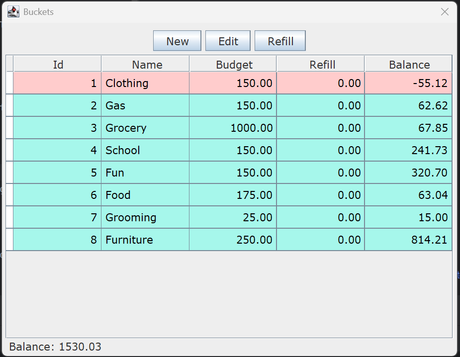
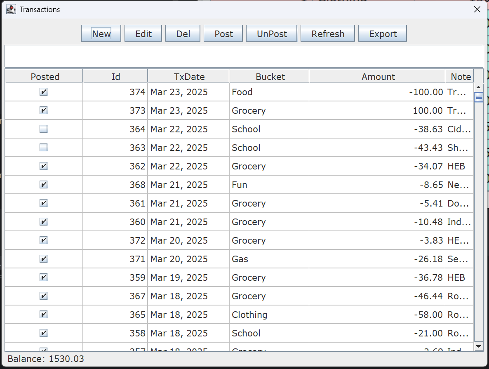

# Home Ledger App

This is simple home ledger application developed using Java Swing. It uses H2 database to store data.
It has 2 main entities - Buckets & Transactions. Buckets have budgets. Use any jdbc client (e.g DBeaver) to view sample schema (ledger.*.db).

## Screens
### Menu

It has sub menu items as Buckets, Transactions and Calculator. 

### Buckets

It has buttons to create new bucket, edit a bucket or refill it.

### Transactions

It has buttons for multiple options. You can do following -
- Create new transaction
- Edit an existing transaction
- Delete
- Post (this is when tx is showing as pending on bank a/c)
- UnPost (reverse of above)
- Refresh screen
- Export selected transactions to CSV file

## Notes
1. This project uses JDatePicker available at https://github.com/JDatePicker/JDatePicker
