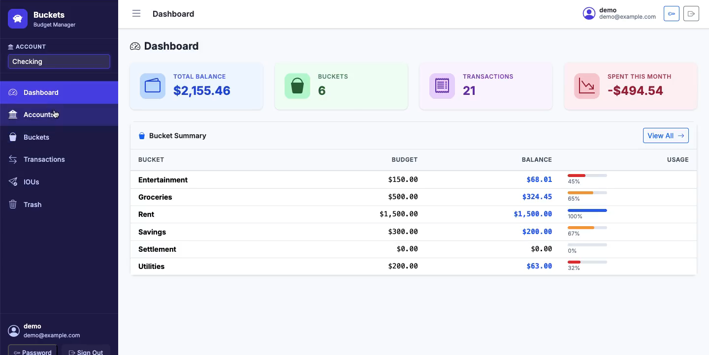
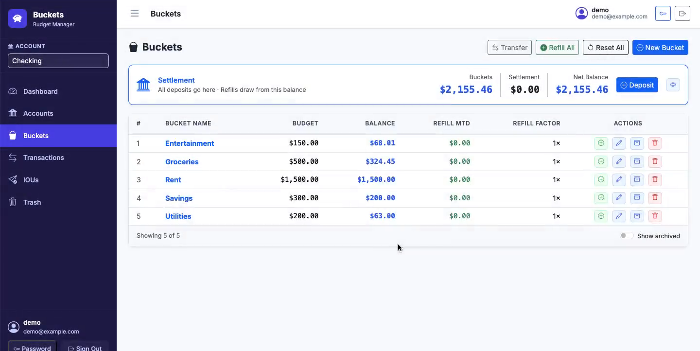
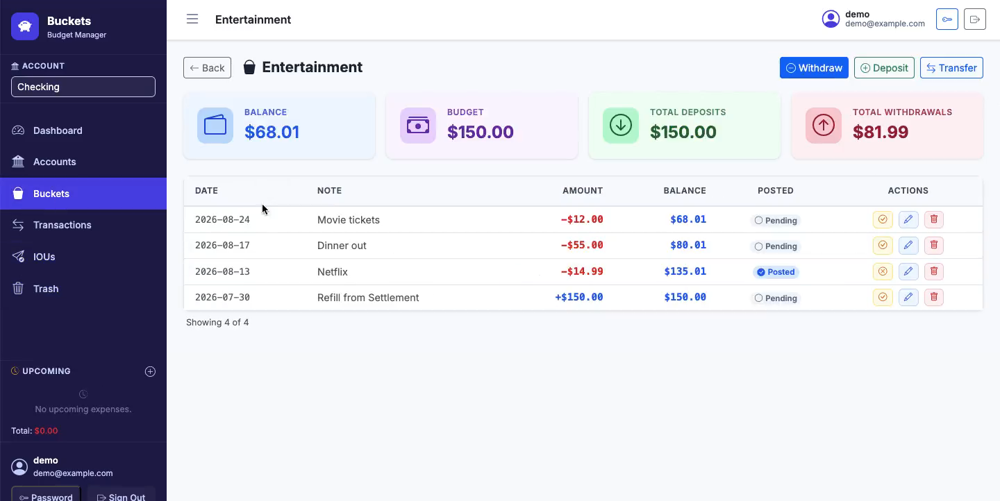

# Buckets

A self-hosted envelope-budgeting web app. Money lives in **accounts**, accounts are divided into **buckets** (budget envelopes like Groceries, Rent, Savings), and every dollar gets refilled into a bucket before it's allowed to be spent — classic envelope budgeting, without spreadsheets.



<p align="center">
  
  
</p>

## About

Buckets is a personal, self-hosted budgeting tool built around the envelope method: instead of tracking a single account balance, money is divided into purpose-specific buckets (Groceries, Rent, Savings, etc.), each refilled from a shared Settlement pool on your own schedule. It's designed for a household or a small number of trusted users who want simple, transparent budget tracking without third-party bank syncing, ads, or a subscription — just a Flask app and a SQLite file you control.

Access is invite-only: there's no signup page, and you create each account yourself from the command line. That keeps a hosted instance closed to everyone but the people you hand credentials to.

## Features

- **Dashboard** — at-a-glance totals (balance, bucket count, transaction count, month-to-date spending) plus a quick bucket summary per account.
- **Accounts & buckets** — organize money into accounts, split each into budget envelopes with per-bucket budgets and refill amounts.
- **Transactions** — record income/spending against a bucket, post/unpost, soft-delete with restore, or purge permanently.
- **Refills** — refill a single bucket or all buckets at once from the account's Settlement pool; reset a bucket's balance.
- **Transfers** — move money between buckets or between accounts.
- **Upcoming expenses** — track bills/expenses you know are coming so they factor into your budget before they hit.
- **IOUs** — request/settle money owed between users, and link an IOU to a real transaction once it's paid.
- **CSV export** — pull transaction history out for spreadsheets or backups.
- **Multi-user, invite-only** — each user has their own accounts and buckets. Accounts are provisioned from the command line with `manage_users.py`; there is no public signup or self-service password reset.

## Tech stack

- **Backend:** Python, [Flask](https://flask.palletsprojects.com/)
- **Database:** SQLite (single file, no server to run)
- **Frontend:** Server-rendered templates + vanilla JS (no build step)
- **Serving:** gunicorn in production, Flask's dev server for local work

## Getting started

The quickest path is Docker. To run from source instead, skip to
[Running from source](#running-from-source).

```bash
mkdir buckets && cd buckets
curl -O https://raw.githubusercontent.com/mohdejaz/buckets/main/docker-compose.yml

# A stable secret key, so restarts don't log everyone out
echo "BUCKETS_SECRET_KEY=$(openssl rand -hex 32)" > .env

# Optional: seed your own account instead of a generated one.
# These are read only on first start, while the database is created.
cat >> .env <<'EOF'
BUCKETS_DEFAULT_NAME=Your Name
BUCKETS_DEFAULT_EMAIL=you@example.com
BUCKETS_DEFAULT_PASSWORD=pick-something-long
EOF

docker compose up -d
```

The app is at [http://localhost:8080](http://localhost:8080). If you skipped the
seed variables, the generated password is printed once in the log:

```bash
docker compose logs buckets
```

The database lives in the `buckets_data` volume, so it survives
`docker compose pull` and recreates. To add the people you're inviting:

```bash
docker compose exec buckets python manage_users.py add "Jane Doe" jane@example.com
```

Images are published to `ghcr.io/mohdejaz/buckets` for amd64 and arm64, so this
works on a Raspberry Pi or an Apple-silicon Mac as well as an x86 box.

Serving it beyond your own LAN means putting a reverse proxy in front for TLS,
and setting `BUCKETS_SECURE_COOKIES=1` in `.env` once you do — read
[Scope and caveats](#scope-and-caveats) first.

## Running from source

Requires Python 3.9+.

```bash
git clone <this-repo>
cd buckets
python -m venv venv

# macOS/Linux
source venv/bin/activate
# Windows
venv\Scripts\activate

pip install -r requirements.txt
```

Then start it:

```bash
python app.py
```

The app starts on [http://localhost:8080](http://localhost:8080). On first run it creates `buckets.db` (gitignored — it's your personal data) and seeds one initial user, plus a sample account with buckets and transactions so there's something to look at.

Since there's no signup page, that seeded user is how you get in. **Its password is generated and printed to the console once, at seed time** — copy it from the startup output:

```
======================================================================
  Seeded the initial Buckets user.
    Email:    demo@example.com
    Password: kekl2k6H6U2eyh
  Shown once, right now. It must be changed at first login.
======================================================================
```

There's no fixed default password on purpose. A hardcoded one would be published in this repo, which on a hosted instance would let a stranger claim the account by setting a password on it. The generated password is single-use: the account is flagged to force a password change, so you'll land on the change-password page before you can reach anything else.

To choose the credentials yourself instead — worth doing for a hosted deployment, so nothing is printed to logs — set these **before the first run**:

```bash
export BUCKETS_DEFAULT_NAME=yourname
export BUCKETS_DEFAULT_EMAIL=you@example.com
export BUCKETS_DEFAULT_PASSWORD=pick-something-long
```

These are only read at seed time. The seed looks for a user matching `BUCKETS_DEFAULT_EMAIL` and creates one if missing, so changing the email later adds a *second* user rather than renaming the first — set them before the first boot, or clean up afterwards with `manage_users.py delete`.

### Managing users

There's no signup page. Provision accounts from the machine running the app, inside the same virtualenv:

```bash
python manage_users.py add "Jane Doe" jane@example.com   # prints a temp password once
python manage_users.py list
python manage_users.py reset-password jane@example.com
python manage_users.py delete jane@example.com
```

`add` and `reset-password` generate a strong temporary password, print it once, and flag the account so the user must choose a new one at next login. Hand that password over a private channel — it isn't emailed. Deleting a user leaves their accounts and buckets orphaned; remove those separately if you care.

### Configuration

| Variable | Purpose |
| --- | --- |
| `BUCKETS_SECRET_KEY` | Signs session cookies. **Set this in production** — the fallback is a random key regenerated on every restart, which logs everyone out. Must stay stable. |
| `BUCKETS_SECURE_COOKIES` | Set to `1` when serving over HTTPS so session cookies are HTTPS-only. Leave unset for plain-HTTP local dev. |
| `BUCKETS_DEFAULT_NAME` / `_EMAIL` / `_PASSWORD` | Credentials for the user seeded on first run. Read only at seed time. If `_PASSWORD` is unset, one is generated and printed to the console once. |
| `BUCKETS_DB_PATH` | Where the SQLite file lives. Defaults to `buckets.db` in the project directory. Point this at a mounted volume on any host with ephemeral disk. |
| `BUCKETS_ADMIN_EMAIL` | Contact address shown on the sign-in page, so an invitee has somewhere to request an account. Rendered as a public `mailto:` link — expect it to be scraped. Unset (the default) falls back to "Contact the administrator for an account." |
| `OPENAI_API_KEY` | Enables receipt scanning. Unset (the default) leaves the feature off entirely and the upload control never renders. |
| `OPENAI_BASE_URL` | Point at any OpenAI-compatible endpoint (Ollama, llama.cpp, LiteLLM) to keep receipt images on your own hardware. Defaults to OpenAI. |
| `BUCKETS_AI_MODEL` | Vision model for receipt scanning. Defaults to `gpt-4o-mini`. |
| `BUCKETS_AI_TIMEOUT` | Seconds to wait on the model before giving up. Defaults to 120. Must stay well under the gunicorn worker timeout — the SDK retries once, so budget double this. |
| `BUCKETS_TIMEOUT` | gunicorn worker timeout used by `run.sh`. Defaults to 300, high because receipt scanning blocks on the model. |
| `HOST` / `PORT` | Bind address for `run.sh`. Defaults to `0.0.0.0:8080`. |

`run.sh` loads a gitignored `.env` file from the project directory if one exists, so you can keep these there for local dev instead of exporting them by hand.

### Receipt scanning (optional)

Photograph a receipt and the app proposes a per-bucket breakdown you review
before anything is saved — one transaction per bucket plus a row for tax,
every one of them editable. Useful for a warehouse-store run where one trip spans
several buckets.

```bash
pip install openai Pillow pillow-heif   # optional; the app runs fine without them
export OPENAI_API_KEY=sk-...
```

Scanning blocks on the model for anywhere from a few seconds to a couple of
minutes, so both `run.sh` and the Dockerfile run gunicorn with a 300s worker
timeout. Lower it and a slow read gets the worker killed mid-request, which
surfaces as a dead connection rather than an error you can act on.

`pillow-heif` lets it read HEIC photos straight off an iPhone; without it,
HEIC uploads are rejected with a message telling you to export as JPEG. It
ships prebuilt for x86_64 and arm64, so the Docker image needs nothing extra.

With Docker, add the key to `.env` — `docker-compose.yml` already forwards it.
Then use **Scan Receipt** on the Transactions page. How it works:

1. The image is downscaled locally, then read by a vision model along with
   your bucket names and a sample of your own past categorisations.
2. Items are **grouped into one transaction per bucket** — a forty-item
   warehouse run becomes three or four ledger entries, not forty. The item
   names go into the description.
3. **Sales tax, your choice.** By default each item carries its share of the
   tax, so a bucket's total is what that bucket really cost. Tax is split
   proportionally across only the lines the receipt marked taxable — read from
   the tax code printed beside the price (`A`, `E`, …), not guessed from the
   product name — and the split is done in integer cents by largest remainder,
   so **the distributed shares add up to the tax on the bill exactly**. A note
   under the toggle confirms it does. Switch the toggle off and items keep
   their printed prices with tax on its own row instead; flipping it is
   instant and never re-reads the receipt.
4. You review a table of buckets with their line items nested underneath.
   Each item has its own description, amount, tax share and bucket, all
   editable — retype a tax share to override it, move an item by changing its
   bucket, or add items the scan missed. The bucket header shows the running
   subtotal, and a readout says whether the tax still adds up to the bill;
   **Recalculate tax** re-spreads it exactly. Items without a bucket block the
   commit until you assign them. **Nothing is written until you confirm.**
5. Committing is all-or-nothing. Buckets are checked against the *combined*
   total of every line hitting them, so a receipt can't half-apply and leave
   you to clean it up.

Rows from one receipt share a `receipt_id`, so a bad scan can be undone as a
unit rather than row by row.

The model transcribes and categorises; it never does arithmetic. Every sum,
tax split, and balance check is computed in Python — a plausible-looking wrong
total is worse than no feature at all.

### Quick-start scripts

- `run.sh` — serves the app with gunicorn on `0.0.0.0:8080` (override with `HOST`/`PORT`). Expects a `venv/` in the project directory and sources `.env` if present.
- `run.bat` — Windows helper that creates the venv, installs dependencies, and starts the app.

## Scope and caveats

Worth knowing before you deploy it:

- **It's a personal-use tool.** It was built iteratively with an AI coding assistant (Claude) rather than from an upfront spec, so it favors "solve the next real problem" over architectural completeness. It hasn't been security-audited or load-tested, and isn't intended for untrusted multi-tenant deployment. Run it for yourself, your household, or a handful of people you know.
- **One instance, one SQLite file.** Writes are serialized and the database is a single file on a single volume. Running two instances against separate copies makes them diverge silently — don't scale it out.
- **No bank syncing.** Every transaction is entered by hand. That's the design, not a missing feature; there's no third-party aggregator holding your credentials.
- **Receipt scanning sends data off your machine.** It's off unless you set `OPENAI_API_KEY`, but when it's on, the receipt image and your bucket names go to the configured API. Nothing else does — there's still no aggregator and no bank credentials anywhere. Set `OPENAI_BASE_URL` to a local model if you want the images to stay put.
- **No self-service account recovery.** There's no signup page and no password-reset email. Accounts are created and reset from the command line with `manage_users.py`, by whoever runs the instance.
- **Back it up yourself.** Nothing is backed up automatically. It's one SQLite file — copy it somewhere on a schedule.

Found a security issue? Please report it privately through
[GitHub's security advisories](https://github.com/mohdejaz/buckets/security/advisories/new)
rather than a public issue.

## Project structure

```
app.py            Flask routes (auth + JSON API)
database.py       SQLite schema, migrations, and seed data
ai.py             Optional receipt parsing — inert without an API key
manage_users.py   CLI to add / list / reset / delete users
templates/        Jinja2 page templates
static/           CSS and vanilla JS frontend
Dockerfile        Production image (gunicorn)
docker-compose.yml Single-service deployment against the published image
docs/images/      README screenshots
```

## License

MIT — see [LICENSE](LICENSE). It covers the source code, not use of a running instance, so people you invite to a hosted deployment have nothing to accept.
